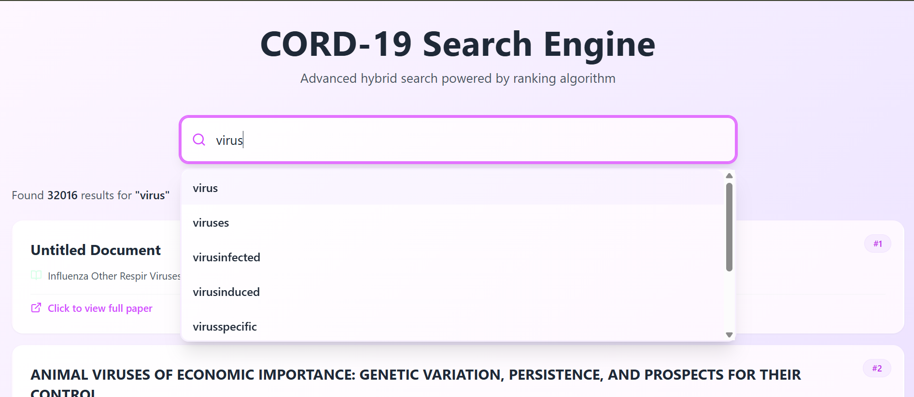
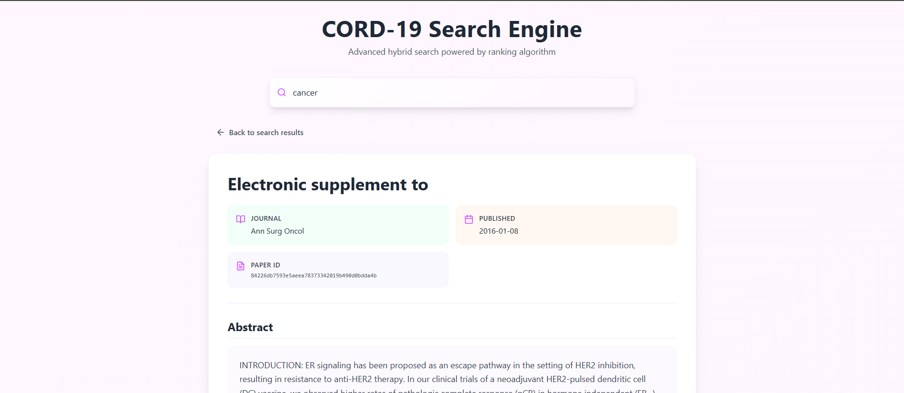

<div align="center">

# CORD-19 Search Engine

**A hybrid lexical + semantic information retrieval system over ~45,000 COVID-19 research papers**


</div>

---

This project is a full-stack **hybrid information retrieval system** built from scratch over approximately **45,000 CORD-19 research papers**. It pairs classical IR machinery — an inverted index, TF‑IDF, field-weighted ranking, boolean and phrase search — with dense semantic retrieval (GloVe embeddings + FAISS ANN search), and exposes the whole thing through a FastAPI backend and a React + TypeScript frontend.

The goal was to understand *how search engines actually work under the hood* — not to call a library and get results, but to build the lexicon, the postings, the barrel files, and the ranking pipeline from first principles, and then make the whole thing fast enough to run interactively on commodity hardware.


## Table of Contents

- [Features](#features)
- [Technologies Used](#technologies-used)
- [System Architecture](#system-architecture)
- [Index Construction Pipeline](#index-construction-pipeline)
- [Core Data Structures](#core-data-structures)
  - [Lexicon](#lexicon)
  - [Forward Index](#forward-index)
  - [Inverted Index](#inverted-index)
  - [Binary Barrels](#binary-barrels)
  - [Trie](#trie)
  - [FAISS Index](#faiss-index)
- [Ranking Strategy](#ranking-strategy)
- [Memory Optimizations](#memory-optimizations)
- [Generated Files](#generated-files)
- [Search Workflow](#search-workflow)
- [Repository Structure](#repository-structure)
- [Running the Project](#running-the-project)
- [API Reference](#api-reference)
- [UI Walkthrough](#ui-walkthrough)
- [Example Queries](#example-queries)
- [Performance](#performance)
- [Future Work](#future-work)
- [Contributors](#contributors)
- [License](#license)

---

## Features

| Category | Capability |
|---|---|
| Lexical Search | Keyword search, boolean search (`AND` / `OR` / `NOT`), exact phrase search |
| Ranking | TF‑IDF scoring, field-weighted ranking (title/abstract/section/authors/journal/body), hybrid lexical + semantic scoring |
| Semantic Search | GloVe query embeddings + FAISS approximate nearest-neighbour retrieval |
| UX | Trie-based autocomplete, instant result previews, full document view |
| Indexing | Incremental index construction (new papers can be added without a full rebuild) |
| Backend | FastAPI REST API with interactive Swagger docs |
| Frontend | React + TypeScript + Vite single-page app |

---

## Technologies Used

**Backend**
- Python
- FastAPI
- NumPy
- FAISS
- NLTK
- ijson (streaming JSON parsing)
- GloVe embeddings

**Frontend**
- React
- TypeScript
- Vite
- TailwindCSS
- Axios

---

## System Architecture

The system is split into two retrieval paths — lexical and semantic — that run independently and are merged at the ranking stage. This separation is what makes the hybrid model possible: each path can be optimized, cached, and scaled on its own terms.

```text
                              User
                               │
                               ▼
                  React + TypeScript Frontend
                               │
                        REST API Requests
                               │
                               ▼
                        FastAPI Backend
                               │
              ┌────────────────┴────────────────┐
              ▼                                  ▼
      Lexical Retrieval                  Semantic Retrieval
              │                                  │
    Binary Barrels + Lexicon               FAISS Index
    Inverted Postings                   GloVe Embeddings
    Trie (autocomplete)              Memory-Mapped Vectors
              └────────────────┬────────────────┘
                                ▼
                         Hybrid Ranking
                                ▼
                         Ranked Results
```

---

## Index Construction Pipeline

Indexing is offline and happens once (or incrementally, as new documents arrive). The pipeline turns raw CORD-19 JSON into the compact on-disk structures the search engine queries at runtime.

```text
CORD-19 JSON
     │
     ▼
Raw Document Mapping
     │
     ▼
Preprocessing
(Tokenization, Stopword Removal,
 Lemmatization, Cleaning)
     │
     ▼
Lexicon Builder
(term → term ID, document frequency)
     │
     ▼
Forward Index
(doc → term → weighted frequency)
     │
     ▼
Inverted Index
(term → posting list)
     │
     ▼
Binary Barrels + Byte Offsets
     │
     ▼
Trie
(prefix structure for autocomplete)
     │
     ▼
GloVe Embeddings
     │
     ▼
FAISS Index
```

Each stage is implemented as a standalone script (see [Repository Structure](#repository-structure)), which keeps the pipeline debuggable — any stage can be re-run in isolation as long as its input artifact exists on disk.

---

## Core Data Structures

### Lexicon

The lexicon is the vocabulary of the entire corpus. For every unique term it stores:

- the term itself
- a numeric term ID
- document frequency (how many documents contain it — needed for IDF)
- the barrel file the term's postings live in
- the byte offset of that posting list within the barrel

The lexicon is small enough to keep fully in memory, and it's what turns a query term into "which barrel, which offset" — the entry point for every lexical lookup.

### Forward Index

The forward index stores, per document, the terms it contains and their field-weighted frequencies:

```text
Document → Term → Weighted Frequency
```

It's primarily an **intermediate structure**: building the inverted index directly from raw documents is awkward, but building it from a forward index — grouping by term instead of by document — is a straightforward inversion. Once the inverted index exists, the forward index isn't needed at query time.

### Inverted Index

The inverted index is the structure that actually makes search fast. It maps:

```text
Term → Posting List (documents containing that term, with weighted frequency)
```

Without it, answering "which documents contain *virus*" would mean scanning all 45,000 documents on every query. With it, the answer is a direct lookup by term ID.

### Binary Barrels

Loading the entire inverted index into RAM doesn't scale — posting lists for common terms can be very large, and holding all of them in memory simultaneously wastes space that's mostly unused per query. Binary barrels solve this by keeping the inverted index **on disk**, in a form that supports cheap, targeted reads.

Postings are serialized into binary barrel files. The lexicon entry for each term stores exactly where its posting list lives:

- the **barrel filename**
- the **byte offset** within that file

At query time, the engine:

1. looks up the term in the lexicon,
2. opens the corresponding barrel file,
3. seeks directly to the byte offset,
4. reads only that term's posting list.

Nothing else in the barrel is touched. This keeps memory usage roughly constant regardless of corpus size, at the cost of a disk seek per term — a good trade-off for a 45k-document corpus running on a single machine.

### Trie

The trie stores the vocabulary as a prefix tree, which makes autocomplete a matter of walking down from the root along the characters typed so far and collecting the words in the subtree — no scanning the full vocabulary per keystroke.

### FAISS Index

FAISS stores the corpus's document embeddings and answers "which documents are semantically closest to this query vector" using approximate nearest-neighbour search, rather than an exact (and much slower) brute-force comparison against all 45,000 vectors. This is what lets the engine return conceptually related papers even when they don't share exact keywords with the query — e.g. a search for *"how does coronavirus affect lung tissue"* can surface papers about pulmonary pathology that never use the word "coronavirus."

---

## Ranking Strategy

Not all occurrences of a term are equally meaningful. A query term appearing in a paper's **title** is a much stronger relevance signal than the same term appearing once in the body text, so each field is weighted before TF‑IDF is computed:

| Field | Weight |
|---|---:|
| Title | 5 |
| Abstract | 4 |
| Section Headings | 3 |
| Authors | 2 |
| Journal | 2 |
| Body Text | 1 |

These weights are applied when the forward index is built, so the weighting is baked into the term frequencies that TF‑IDF operates on — no extra pass is needed at query time.

Lexical relevance (TF‑IDF over weighted fields) and semantic relevance (FAISS cosine/L2 similarity over GloVe embeddings) are then combined into a single hybrid score:

```
Final Score = α × Lexical Score + (1 − α) × Semantic Score
```

With the current configuration, **α = 0.6** — lexical relevance is weighted more heavily, with semantic similarity acting as a secondary signal that surfaces conceptually related results the keyword match alone would miss.

---

## Memory Optimizations

Working with 45,000 documents and their embeddings on a single machine forces some deliberate engineering trade-offs:

- **Binary barrel storage** — posting lists live on disk and are read via seek + offset instead of being fully loaded into RAM (see [Binary Barrels](#binary-barrels)).
- **Memory-mapped GloVe vectors** — embeddings are memory-mapped rather than loaded wholesale, so the OS pages them in on demand instead of the process holding the full matrix in memory.
- **Incremental indexing** — new documents can be folded into the existing lexicon, forward index, and barrels without reprocessing the entire corpus from scratch.
- **Streaming JSON with `ijson`** — the raw CORD-19 JSON files are parsed incrementally instead of being loaded into memory in full, which matters because individual paper JSONs can be large and numerous.
- **Trie for autocomplete** — avoids scanning the full vocabulary on every keystroke.
- **FAISS ANN search** — avoids brute-force similarity comparison against every document vector.

Each of these targets the same underlying constraint: keep per-query memory and compute proportional to the query, not to the size of the corpus.

---

## Generated Files

The indexing pipeline produces the following on-disk artifacts, all consumed by the backend at query time:

| File / Directory | Purpose |
|---|---|
| `lexicon.json` | Vocabulary: term → term ID, document frequency, barrel location |
| `processed_docs_log.json` | Tracks which documents have already been indexed (enables incremental indexing) |
| Forward index files | Intermediate doc → term → weighted frequency mapping, used to build the inverted index |
| `barrels/` | Binary posting list files, read via lexicon byte offsets |
| `glove_word_index.npy` | Maps vocabulary terms to rows in the GloVe embedding matrix |
| `glove_200d_memmap.npy` | Memory-mapped GloVe embedding vectors |
| `faiss_index.index` | FAISS index of document embeddings for semantic search |
| `doc_names_memmap.npy` | Memory-mapped mapping from FAISS result rows back to document IDs |

---

## Search Workflow

What happens between a user pressing Enter and results appearing on screen:

```text
User submits query
        │
        ▼
Query preprocessing (tokenize, normalize)
        │
        ▼
Trie lookup for autocomplete suggestions
        │
        ▼
Binary barrels retrieve posting lists
        │
        ▼
TF‑IDF + field weights → lexical score
        │
        ▼
GloVe builds a query embedding
        │
        ▼
FAISS retrieves semantic neighbours
        │
        ▼
Scores normalized
        │
        ▼
Hybrid ranking combines lexical + semantic score
        │
        ▼
Top documents returned to frontend
```

---

## Repository Structure

```text
cord-19_searchEngine/
├── api/                              # FastAPI backend
├── frontend/                         # React + TypeScript frontend
├── src/
│   ├── preprocessing.py              # Tokenization, stopword removal, lemmatization
│   ├── build_raw_docs.py             # Parses raw CORD-19 JSON into document records
│   ├── lexicon_builder.py            # Builds the term → ID / DF lexicon
│   ├── forward_Index_Builder.py      # Builds the forward index
│   ├── inverted_index_builder.py     # Inverts the forward index into term → postings
│   ├── build_binary_barrel.py        # Serializes postings into binary barrel files
│   ├── build_trie.py                 # Builds the autocomplete trie
│   ├── vectorize_and_index_incremental.py  # GloVe embeddings + FAISS index construction
│   ├── search.py                     # Query-time retrieval logic
│   └── ranking.py                    # TF-IDF, field weighting, hybrid scoring
├── data/                              # Indexed artifacts (lexicon, barrels, embeddings, etc.)
├── requirements.txt
└── README.md
```

---

## Running the Project

Start the backend first, then the frontend.

### Backend

```bash
cd api
uvicorn server:app --reload
```

- API: http://127.0.0.1:8000
- Interactive docs (Swagger UI): http://127.0.0.1:8000/docs

### Frontend

```bash
cd frontend
npm install
npm run dev
```

- App: http://localhost:3000

---

## API Reference

The frontend communicates with the backend exclusively through these endpoints:

| Endpoint | Method | Description |
|---|---|---|
| `/api/search` | `POST` | Runs a lexical + semantic hybrid search and returns ranked results |
| `/api/autocomplete` | `GET` | Returns trie-based term suggestions for a partial query |
| `/api/document/{doc_id}` | `GET` | Returns the full content and metadata for a single document |

Full request/response schemas are available at `/docs` once the backend is running.

---

## UI Walkthrough

**Home page** — a single search bar, nothing else competing for attention:


**Autocomplete** — as the user types, the trie returns matching vocabulary terms in real time:



**Search results** — ranked results with journal, publication date, and an abstract snippet; clicking a result opens the full paper:


**Document view** — full metadata and abstract for a single paper, reached by clicking any result:



---

## Example Queries

**Keyword**
```
covid vaccine
```

**Phrase**
```
"immune response"
```

**Boolean**
```
covid AND vaccine
virus NOT influenza
```

**Semantic**
```
How does coronavirus affect lung tissue?
```

---

## Performance

- Indexes approximately **45,000 CORD-19 papers**
- Posting lists are stored as **binary barrels** and read via seek + offset rather than loaded wholesale
- GloVe vectors are **memory-mapped**, not fully loaded into RAM
- New documents can be added via **incremental indexing** without a full rebuild
- Semantic search uses **FAISS approximate nearest-neighbour** retrieval instead of brute-force comparison

No formal latency or memory benchmarks have been collected yet — see [Future Work](#future-work).

---

## Future Work

- BM25 as an alternative/additional lexical scoring model
- Query expansion
- Spell correction
- Improved snippet generation around matched terms
- Docker-based deployment
- Continuous/streaming indexing
- Learning-to-Rank
- Cross-encoder reranking of top candidates

---

## Contributors

- [Amna Ahmed](https://github.com/)
- [Ridanawaz2701](https://github.com/Ridanawaz2701)
- [nshanbse24seecs-dot](https://github.com/nshahbese24seecs-dot)

---

## License

Developed for academic purposes.
